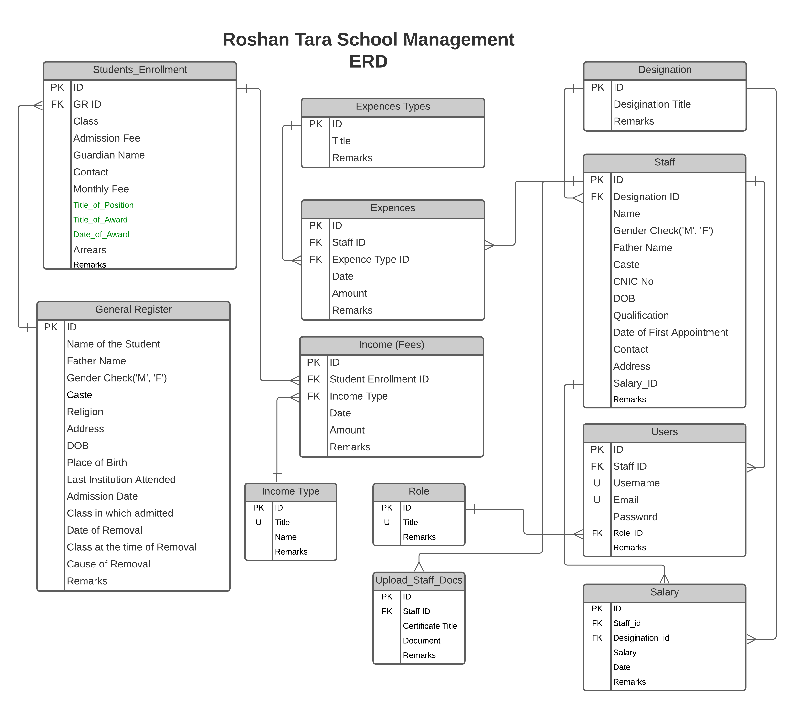

# rtsm-django

## Applications

1.  **APIS**
2.  **User** (Custom user model, refered [this article](https://testdriven.io/blog/django-custom-user-model/#user-model))
3.  **Website** (To server static web pages, for now. Following [this article](https://www.digitalocean.com/community/tutorials/working-with-django-templates-static-files).)

---

## ERD

> Implemented the customuser model, refereing the apis.staff mode.
> **Note, code for all of these models is avaialbe, will paste when needed, trying to complete the authenticaton for now.**

---

- Using sqltite for now, will switch to MongoDB once erd is completed.
